# deploy_shiny_aws

I recently want to deploy my intern company's R shiny on aws so that everyone can use it. I googled some tutorials but some of them is outdataed, so I just want to write one to document it. (Just in case I need to deploy shiny again in the future).

I mainly used tutorial from here: https://tm3.ghost.io/2017/12/31/deploying-an-r-shiny-app-to-aws/

### Today I will go over xxxx things:

* Create an instance on aws
* Deploy a sample R shiny on aws
* Set up username and password when login the shiny

### Step 1: Create an instance on aws

If you are a student, you can google aws student and sign up there by using your edu email to get some credits. Here, I assume you already have the account. 

Click on the `EC2` button, then `Launch Instance`, it will lead you to `choose AMI` page. Select the newest `Unbuntu Server`.

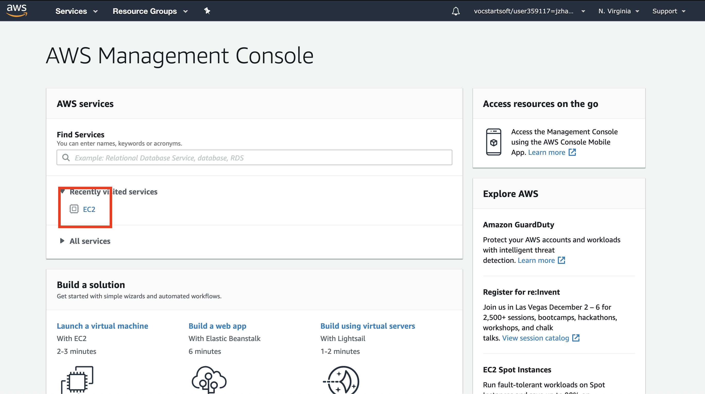 
<br/><br/>
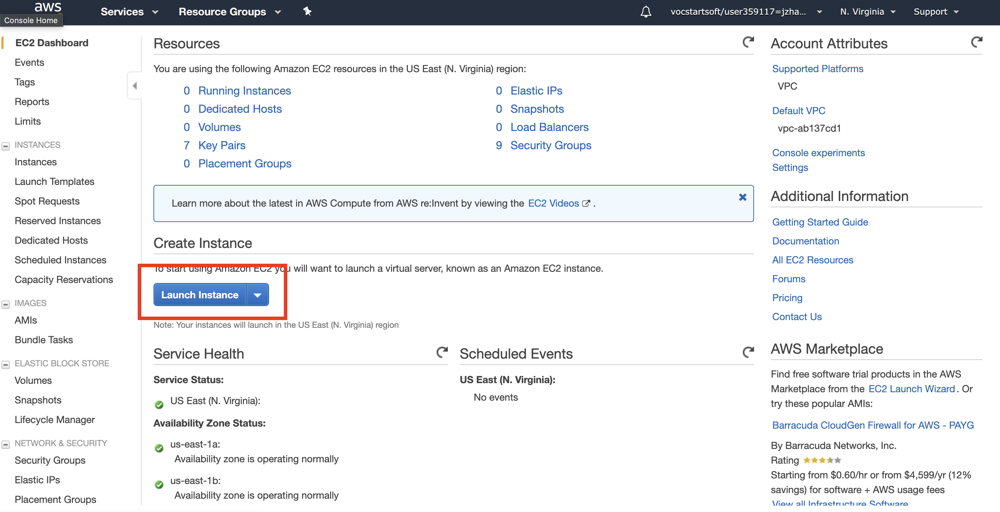
<br/><br/>
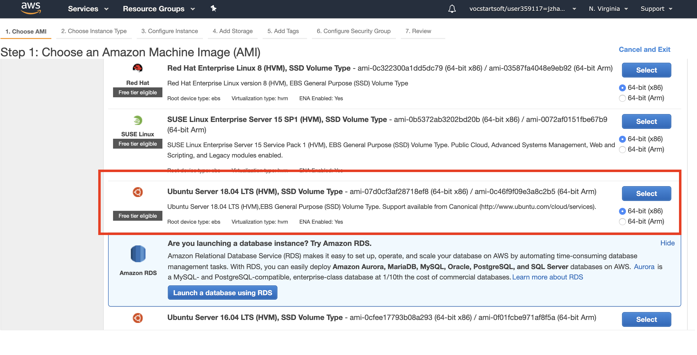

Then you goes to `Step 2: Choose an Instance Type`, here I choose `t2.micro` since it's free, you can choose your own depends on you need. Check this link to select the instance type you need: https://aws.amazon.com/ec2/instance-types/. Then click `Next: Configure Instance Details`. Don't click `Review and Launch`. 

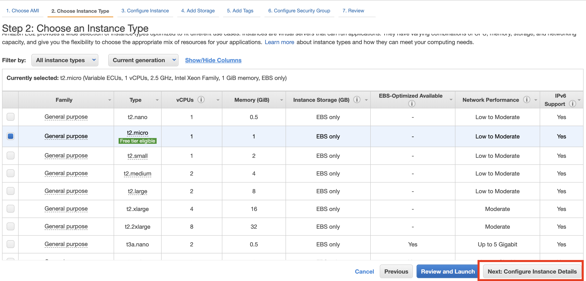

Leave the `Step 3: Configure Instance Details` as it is, and click `Next: Add Storage`. 

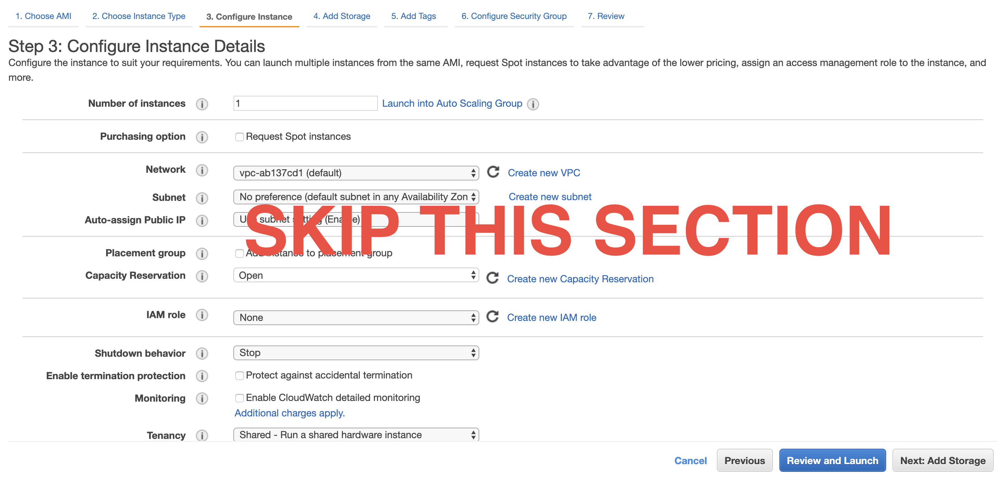

Change `Size (GiB)` to 16GB as recommend by some R bloggers. Click `Next: Add Tags`.

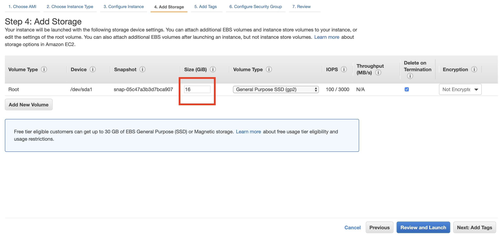

Click `Add tag` and type the name under the `key`. Here, mine is `sample_shiny`. Next, click `Next: Configure Security Group`. 

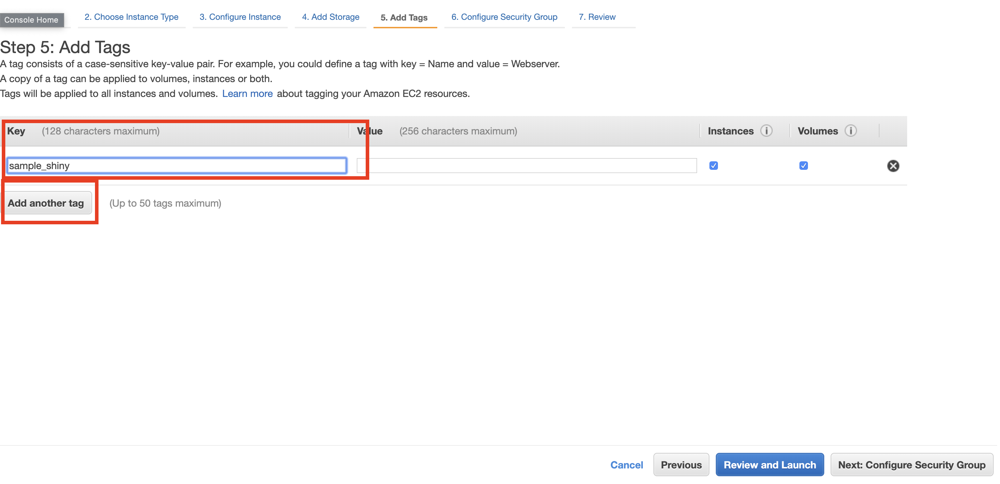

This section is really important. It allows users to access the r studio and the shiny. Please choose the configuration as specified below. Then click `Review and Launch`. 

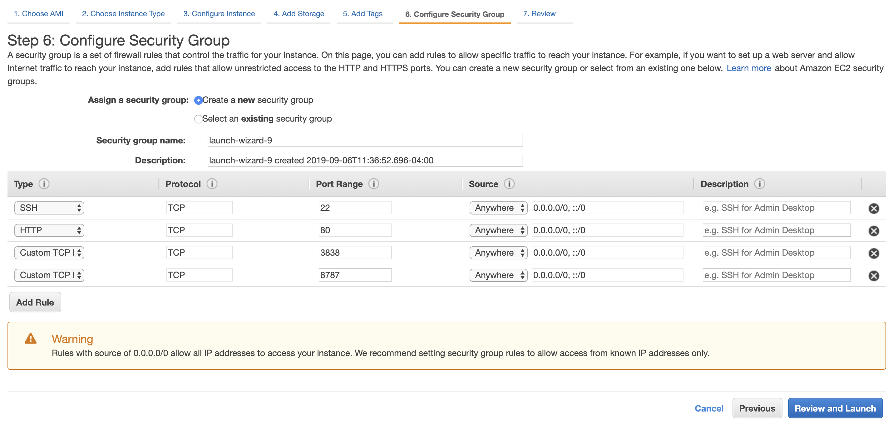

Almost done!!! Click the `Launch` button and choose `Create a new key pair`. Type in the key name you want, mine is `sample_shiny`. Then click **`Download key pair`** and save the download file in a folder you want. As a demonstration, I saved mine on Desktop, you should save it to a more secure location just in case you won't accidentally delete it. After you down, you should see a file named your_key_name.pem in your specified folder location. Lastly, click `Launch Instances`. 

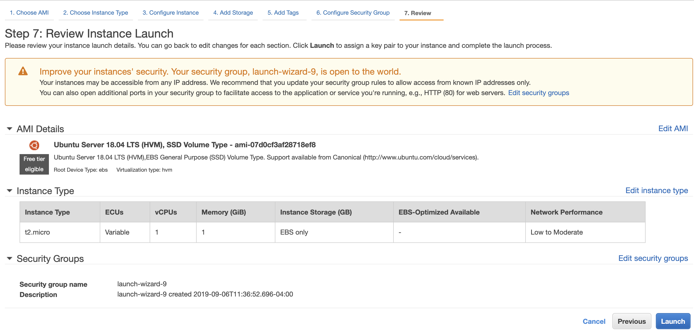

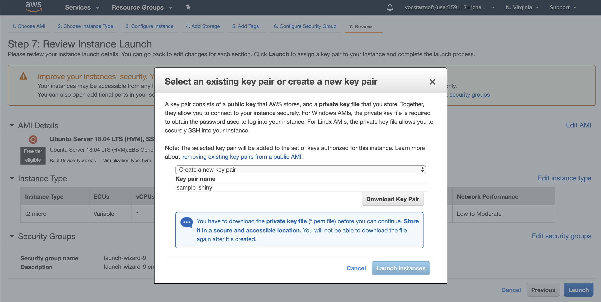

If you see this "Your instances are now launching", that means you are good to go. Click on the Instance ID in the red box.

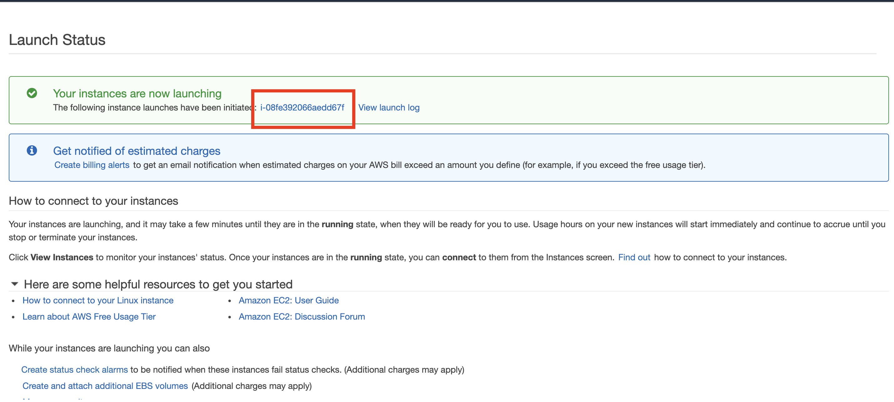


Connect to instance by clicking `Connect` and you should see a window pops up that tells you how to access your instance. Open your terminal on your laptop; I use the Terminal app on Mac. cd to the folder that store the key you just downloaded; mine is in Desktop. 

Copy and paste the commnad line from step 3 in popped up window to terminal. 

Mine is `chmod 400 sample_shiny.pem`. 

Copy and paste `ssh -i "sample_shiny.pem" ubuntu@yourpublicDNS` to terminal. You can find this from `Example` in popped up window. 

Type `yes` to `Are you sure you want to continue connecting (yes/no)?`. 

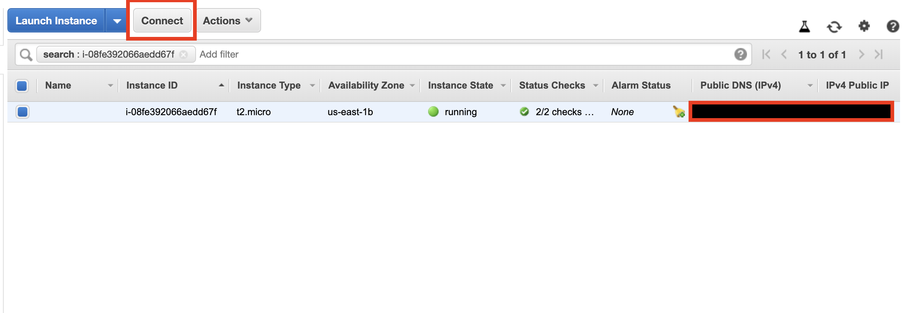

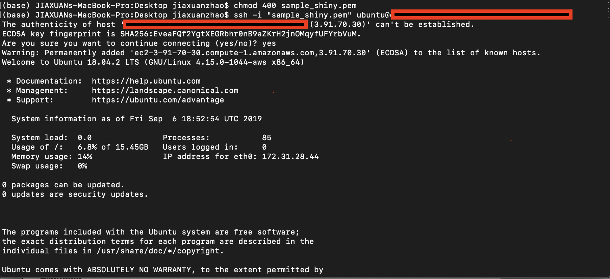

If you see something like `ubuntu@xxx`, you are connected. 

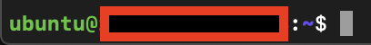

### Step 2: 

Install required libraries. 


```
$ sudo apt-get update
$ sudo apt-get -y install \
    nginx \
    gdebi-core \
    apache2-utils \
    pandoc \
    pandoc-citeproc \
    libssl-dev \
    libcurl4-gnutls-dev \
    libcairo2-dev \
    libgdal-dev \
    libgeos-dev \
    libproj-dev \
    libxml2-dev \
    libxt-dev \
    libv8-dev
```


### Step 2: Deploy R shiny


