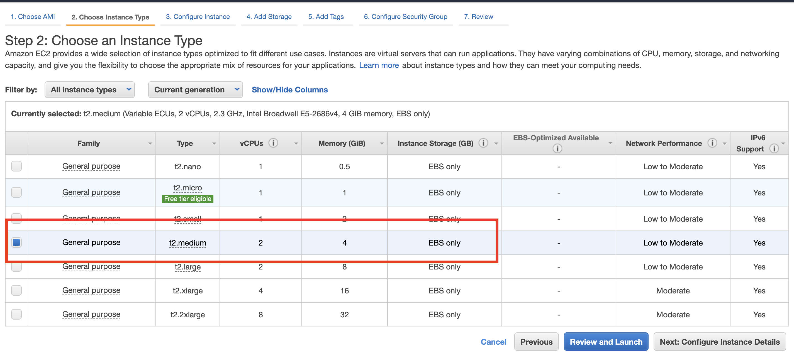
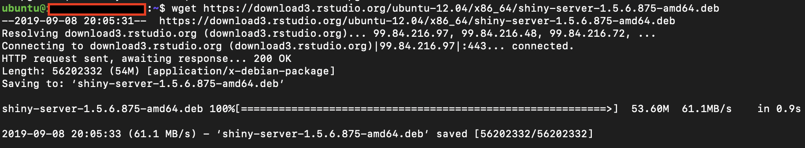

# Deploy shiny on aws

I recently want to deploy my intern company's R shiny on aws so that everyone can use it. I googled some tutorials but some of them is outdataed, so I just want to write one to document it. (Just in case I need to deploy shiny again in the future).

I'm pretty new to this field, happy to disscuss. 

I mainly used tutorial from here: 
https://tm3.ghost.io/2017/12/31/deploying-an-r-shiny-app-to-aws/

https://www.digitalocean.com/community/tutorials/how-to-install-r-on-ubuntu-18-04

https://www.linode.com/docs/development/r/how-to-deploy-rshiny-server-on-ubuntu-and-debian/

https://www.rstudio.com/products/rstudio/download-server/

### Today I will go over xxxx things:

* Create an instance on aws
* Deploy a sample R shiny on aws
* Set up username and password when login the shiny

### Step 1: Create an instance on aws

If you are a student, you can google aws student and sign up there by using your edu email to get some credits. Here, I assume you already have the account. 

Click on the `EC2` button, then `Launch Instance`, it will lead you to `choose AMI` page. Select the newest `Unbuntu Server`.

 
<br/><br/>

<br/><br/>


Then you goes to `Step 2: Choose an Instance Type`, here I choose `t2.medium` since it has 4GB memory, you can choose your own depends on you need. I also tried `t2.micro`, it's too small so that I can't even install R packages. Check this link to select the instance type you need: https://aws.amazon.com/ec2/instance-types/. Then click `Next: Configure Instance Details`. Don't click `Review and Launch`. 



Leave the `Step 3: Configure Instance Details` as it is, and click `Next: Add Storage`. 


Change `Size (GiB)` to 16GB as recommend by some R bloggers. Click `Next: Add Tags`.


Click `Add tag` and type the name under the `key`. Here, mine is `sample_shiny`. Next, click `Next: Configure Security Group`. 


This section is really important. It allows users to access the r studio and the shiny. Please choose the configuration as specified below. Then click `Review and Launch`. 


Almost done!!! Click the `Launch` button and choose `Create a new key pair`. Type in the key name you want, mine is `sample_shiny`. Then click **`Download key pair`** and save the download file in a folder you want. As a demonstration, I saved mine on Desktop, you should save it to a more secure location just in case you won't accidentally delete it. After you down, you should see a file named your_key_name.pem in your specified folder location. Lastly, click `Launch Instances`. 


If you see this "Your instances are now launching", that means you are good to go. Click on the Instance ID in the red box.


Connect to instance by clicking `Connect` and you should see a window pops up that tells you how to access your instance. Open your terminal on your laptop; I use the Terminal app on Mac. cd to the folder that store the key you just downloaded; mine is in Desktop. 

Copy and paste the commnad line from step 3 in popped up window to terminal. 

Mine is `chmod 400 sample_shiny.pem`. 

Copy and paste `ssh -i "sample_shiny.pem" ubuntu@yourpublicDNS` to terminal. You can find this from `Example` in popped up window. 

Type `yes` to `Are you sure you want to continue connecting (yes/no)?`. 


If you see something like `ubuntu@xxx`, you are connected. 


### Step 2: Install system libraries, R, R studio server, R shiny server.  

From your terminal you just logged in. 

**I. Install system required libraries. **

```
$ sudo apt-get update
$ sudo apt-get -y install \
    nginx \
    gdebi-core \
    apache2-utils \
    pandoc \
    pandoc-citeproc \
    libssl-dev \
    libcurl4-gnutls-dev \
    libcairo2-dev \
    libgdal-dev \
    libgeos-dev \
    libproj-dev \
    libxml2-dev \
    libxt-dev \
    libv8-dev
```

**II. Install R to ubuntu 18.04. **

Follow this link: https://www.digitalocean.com/community/tutorials/how-to-install-r-on-ubuntu-18-04
Remeber if your ubuntu is not 18.04, you probably need to google the newest installation code. 
```
$ sudo apt-key adv --keyserver keyserver.ubuntu.com --recv-keys E298A3A825C0D65DFD57CBB651716619E084DAB9
$ sudo add-apt-repository 'deb https://cloud.r-project.org/bin/linux/ubuntu bionic-cran35/'
$ sudo apt update
$ sudo apt install r-base
```

If your R is succefully installed, then R will show up if you type `sudo -i R`. Here mine R is 3.6.1 (2019-07-05). Your version can be different than mine. 


**III. Install Shiny Server ** 

Follow install shiny server from this link: https://www.linode.com/docs/development/r/how-to-deploy-rshiny-server-on-ubuntu-and-debian/

You should see something like this: 
```
### Install gdebi
sudo apt install gdebi-core
```

<br/><br/>
```
### Download Shiny Server
wget https://download3.rstudio.org/ubuntu-12.04/x86_64/shiny-server-1.5.6.875-amd64.deb
```

<br/><br/>

Type `y` to `Do you want to install the software package? [y/N]:`
If your shiny server is succesfully installed and running, you should see: `Active: active (running)`. 
```
### Use gdebi to install the Shiny Server package
sudo gdebi shiny-server-1.5.6.875-amd64.deb
```

<br/><br/>
```
### The shiny-server service should start automatically. Check its status
sudo systemctl status shiny-server.service
```

<br/><br/>

**IV. Install R studio Server ** 

Follow install R studio server from this link:
https://www.rstudio.com/products/rstudio/download-server/

Choose the one based on your ubuntu version. Probably need to change something if your ubuntu is not 18.04. 

You should see something like this: 

```
$ sudo apt-get install gdebi-core
$ wget https://download2.rstudio.org/server/bionic/amd64/rstudio-server-1.2.1335-amd64.deb
$ sudo gdebi rstudio-server-1.2.1335-amd64.deb
```


<br/><br/>

Answer `y` to `Do you want to install the software package? [y/N]:`

<br/><br/>

If R studio server is running, you should see `Active: active (running)`

<br/><br/>

### Step 2: Deploy R shiny

**V. Install R Libraries**

Install the libraries you need, may talk a while to run.

```
$ sudo su - -c "R -e \"install.packages(c('shiny', 'rmarkdown', 'shinydashboard', 'shinyjs'), repos='http://cran.rstudio.com/')\""

$ sudo su - -c "R -e \"install.packages(c('ggplot2', 'dplyr', 'tidyr', 'readr', 'lazyeval', 'stringr', 'ggthemes', 'ggExtra', 'magrittr', 'viridis', 'gridExtra', 'lubridate', 'fasttime', 'data.table'), repos='http://cran.rstudio.com/')\""

```

**VI. Change configuration files **

Back in terminal, stop the nginx service and the shiny-server.

```
$ sudo service nginx stop
$ sudo stop shiny-server
```

Change R Studio Config:

```
$ sudo vi /etc/nginx/sites-available/default
```

You will see something like this. Comment everything in this file. Everythinggggg !!!!!!
Type `i` to enter `insert` mode and use `#` to comment.


<br/><br/>

Copy and paste the following to the file:

```
server {
    listen 80;

    location / {
    proxy_pass http://127.0.0.1:3838/;
    proxy_redirect http://127.0.0.1:3838/ $scheme://$host/;
    proxy_http_version 1.1;
    proxy_set_header Upgrade $http_upgrade;
    proxy_set_header Connection "upgrade";
    auth_basic "Username and Password are required";
    auth_basic_user_file /etc/nginx/.htpasswd;
 }
}
```
Use `esc` to exsit `insert` mode, type `:wq` to save and quit.  


Change R Shiny Config:

```
$ sudo vi /etc/shiny-server/shiny-server.conf
```

Type `i` to enter `insert` mode and use `#` to comment.

Copy and paste the following to the file:

```
# Instruct Shiny Server to run applications as the user "shiny"
run_as shiny;

# Define a server that listens on port 3838
server {
  listen 3838;

  # Define a location at the base URL
  location / {

    # Host the directory of Shiny Apps stored in this directory
    site_dir /srv/shiny-server;

    # Log all Shiny output to files in this directory
    log_dir /var/log/shiny-server;

    # When a user visits the base URL rather than a particular application,
    # an index of the applications available in this directory will be shown.
    directory_index on;
  }
}
```
Use `esc` to exsit `insert` mode, type `:wq` to save and quit.  

**VII. Password Protecting the shiny App **

If you don't want everyone to access your shiny, you can set password to protect it. Here, I set name as Crystal.
Enter the password. 

```
$ cd /etc/nginx
$ sudo htpasswd -c /etc/nginx/.htpasswd Crystal
```

Add more users. You need to leave out the -c argument for any additional users you wish to add. 

```
$ sudo htpasswd /etc/nginx/.htpasswd Newuser
```

**VIII. Password Protecting the R studio **

Start nginx and shiny:
```
$ sudo systemctl start shiny-server
$ sudo service nginx start
```

The login name is ubuntu, change the password:
```
$ sudo passwd ubuntu
```

Resart nginx and shiny:

```
$ sudo systemctl restart shiny-server
$ sudo service nginx restart
```
Now, your shiny server and studio server should work. Open your broswer, type `IPv4 Public IP:8787`, login with username `ubuntu` and password, you should then see the R studio server. The `IPv4 Public IP` is your ip address.


<br/><br/>

Type `IPv4 Public IP:3838` login with username and password you just created, you should see something like this.
The `IPv4 Public IP` is your ip address.


<br/><br/>

### Step 3: Deploy shiny

In this tutorial, I already upload my shiny code to github, called deploy_shiny_sample https://github.com/JiaxuanZhao/deploy_shiny_sample. The code comes from one of the shiny tutorial. 

Now back to terminal,

```
$ cd /srv/shiny-server
$ ls
```
You should see one index.html and one sample-apps


<br/><br/>

```
## Having problems with file permissions? 
$ sudo chmod 7777 /srv/shiny-server/

## install git
$ sudo apt-get install git
```

Back to github, clone the deploy_shiny_sample repo using the "Clone with HTTPS" url: 

```
$ git clone https://github.com/JiaxuanZhao/deploy_shiny_sample.git
$ ls
```

<br/><br/>

You should see an extra folder called `deploy_shiny_sample`.


Restart nginx and shiny:

```
$ sudo systemctl restart shiny-server
$ sudo service nginx restart
```

In the web broswer, type `IPv4 Public IP/deploy_shiny_sample`, now you can see your shiny app. 


<br/><br/>

#### Success.